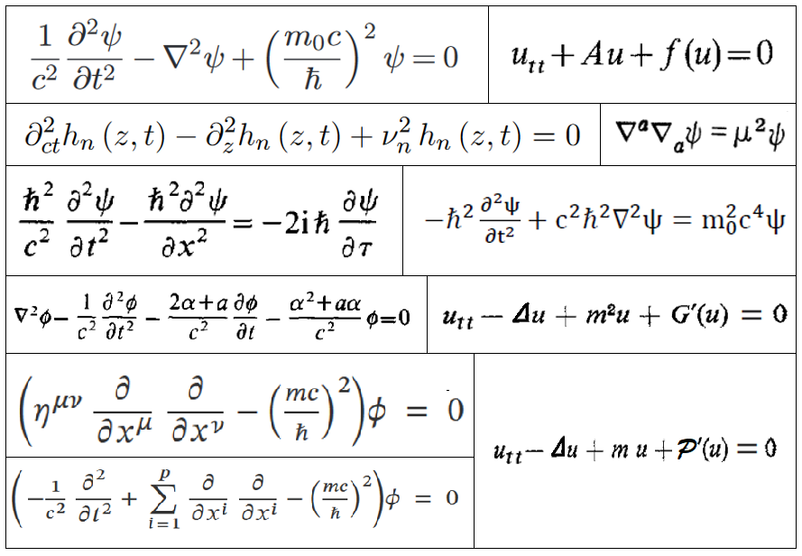

# Formula Concept Retrieval for Mathematical Entity Linking (MathEL)

This repository contains data, and algorithms for Formula Concept Discovery (FCD) and Formula Concept Recognition (FCR) experiments presented in the journal paper 'Discovery and Recognition of Formula Concepts using Machine Learning' by Scharpf, Schubotz, and Gipp.

In this paper, we suggest how mathematical formulas could be cited and define a 'Formula Concept Retrieval' task with two subtasks: Formula Concept Discovery (FCD) and Formula Concept Recognition (FCR). While FCD aims at the definition and exploration of a 'Formula Concept' that names bundled equivalent representations of a formula, FCR is designed to match a given formula to a prior assigned unique mathematical concept identifier. We present Machine Learning based approaches to address the FCD and FCR tasks. We then evaluate these approaches on a standardized test collection (NTCIR arXiv dataset). Our FCD approach yields a precision of 68% for retrieving equivalent representations of frequent formulas and a recall of 72% for extracting the formula name from the surrounding text. FCD and FCR enable the citation of formulas within mathematical documents and facilitate semantic search and question answering as well as document similarity assessments for plagiarism detection or recommender systems.

### Motivation

Documents from Science, Technology, Engineering, and Mathematics (STEM) often contain a significant amount of mathematical formulas. Formulas are usually vital for understanding the content of STEM documents. Also, systems such as semantic search engines, question answering systems, and document recommender systems should be able to process formulas and their connection with surrounding text and mathematical expressions.
In information science and technology, the semantics of natural language is typically grasped via conceptualization (Yucong et al., 2011). According to (Gruber et al., 1993), the term conceptualization refers to the process of simplifying the representation of objects of discourse and specifying a semantic vocabulary in an ontology (knowledge system). Analogously, to capture the semantics of mathematical language in formulas, here we argue for the introduction of a mathematical 'Formula Concept', which we define to be a collection of equivalent formulas with different representations. This extends the definition of the 'formula content' comprising constituents, relations, and semantics of a formula, which was  introduced in (Scharpf et al., 2018).

We present the Klein-Gordon equation as an example for mathematical conceptualization. The above figure shows different representations of the Klein-Gordon equation (https://en.wikipedia.org/wiki/Klein-Gordon_equation), also referred to as a 'relativistic wave equation' from quantum mechanics.
These representations of the Klein-Gordon equation appear to be diverse but they all are representatives of the same mathematical concept. Employing additional Formula Concept examples, we illustrate and discuss differences and explain the resulting challenges of this conceptualization process in detail. We introduce two tasks: 1) Formula Concept Discovery (FCD), and 2) Formula Concept Recognition (FCR) to (1) identify Formula Concepts and (2) find formulas that are instances of particular Formula Concepts.